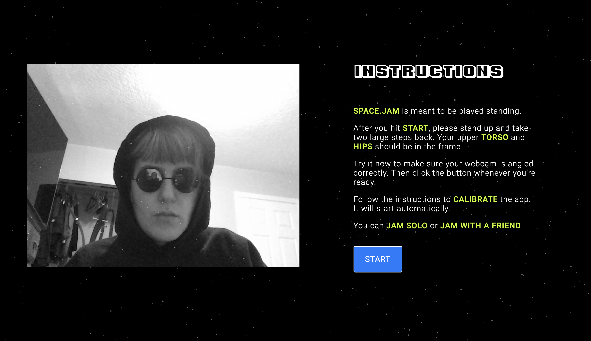
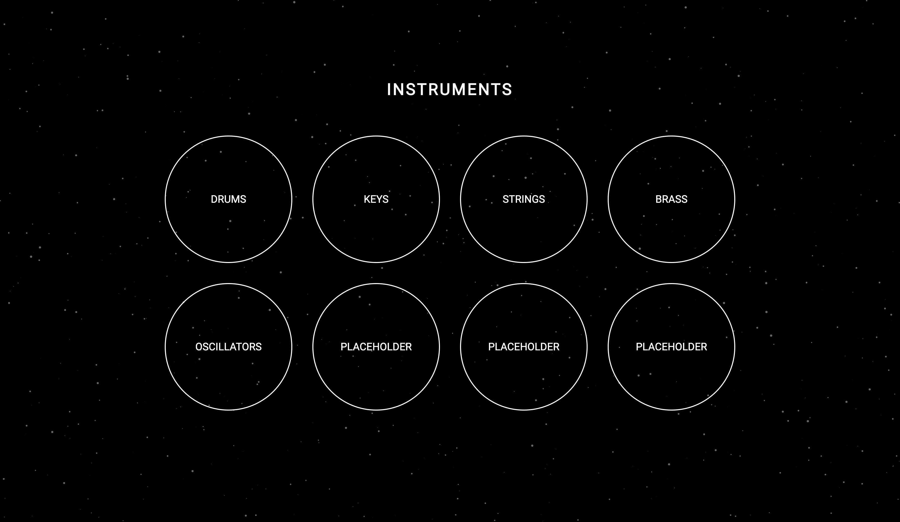
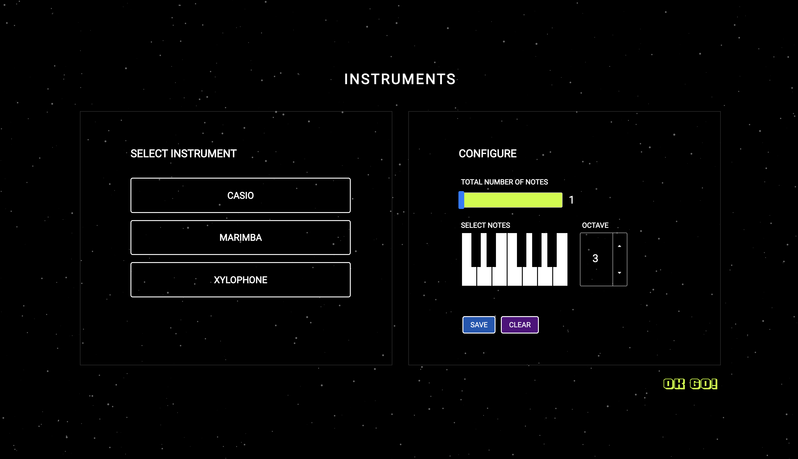
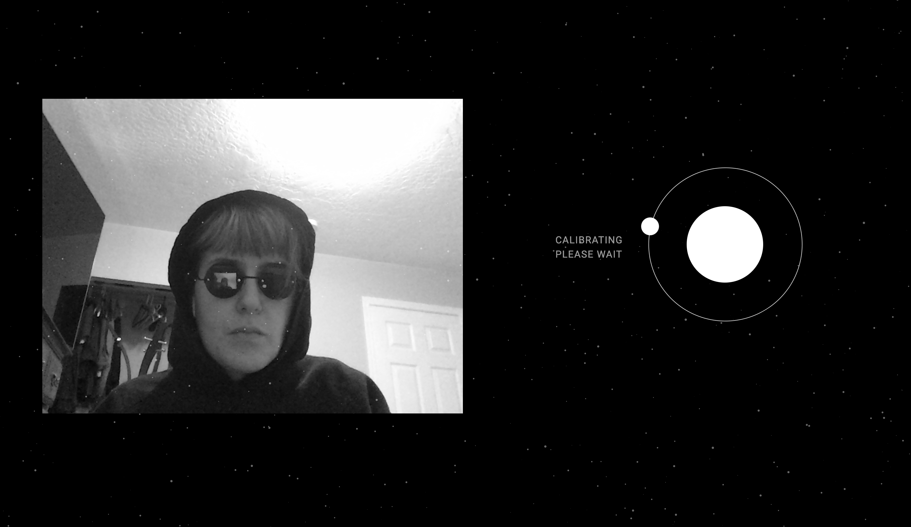
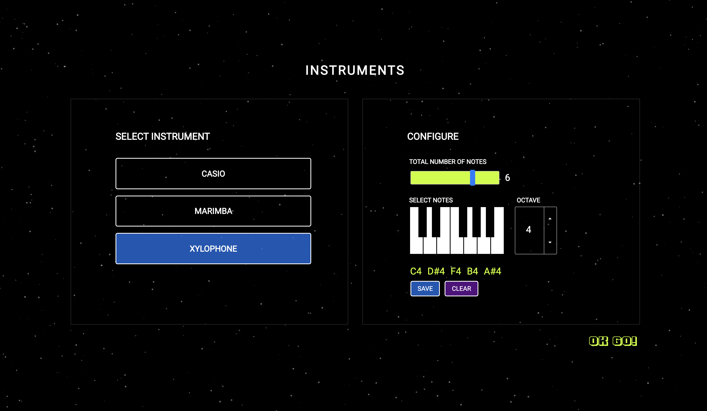
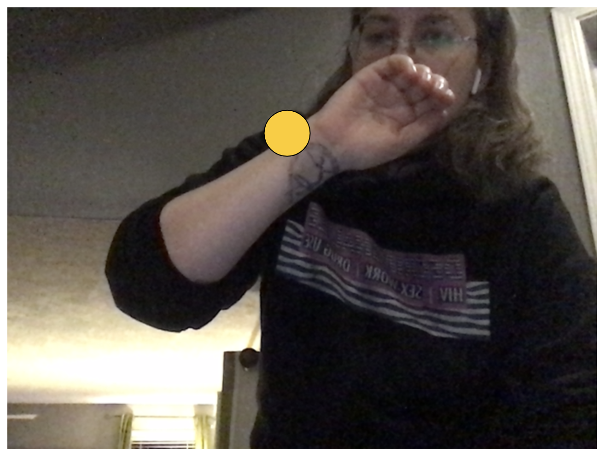
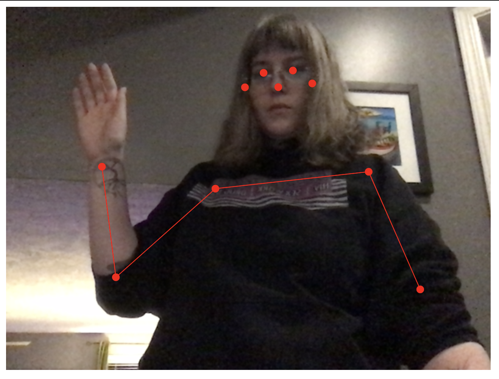
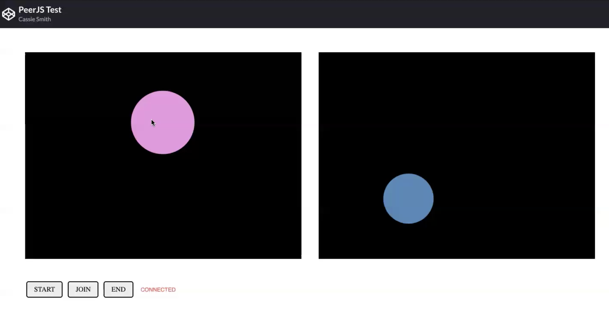

# Final Documentation: SPACE.JAM

## SCREENSHOTS



## COMPONENTS

1. INTERACTION - POSE TRACKING WITH POSENET
2. SOUND - VIRTUAL INSTRUMENTS WITH TONE.JS
3. GRAPHICS - P5.JS
4. P2P NETWORKING - PEER.JS

### PEER.JS (NETWORKING)

Real-time communication is the essential feature of this project. While I have plans to implement persistent-state features in the future (see FUTURE DEV), [I focused on getting the WebRTC functionality]. Initially, I experimented with a combination of WEBRTC P2P and SOCKET.IO (websockets). But, I decided to go with PEER.JS, which is a peer-to-peer connection API that wraps the browser's WebRTC implementation. It also uses websockets for signaling, so it's functionality is similar to the example I was originally working from.

I do believe in doing things from the ground up in order to develop a solid basis as a programmer. But, in this case using the PEER.JS API had a couple of key benefits:

It allowed me to save time and test the functionality quickly, which was important considering the numerous other elements of the project I needed to implement.
PEER.JS provides the option of running your own PeerServer (it is open source and written in NODE.JS), but also offers a free cloud-hosted version of PeerServer.
Handles serialization of data for you [can be binary (default), binary-utf8, json, or none].

I started building my own back-end, integrating a PeerServer with an Express App. This was partly to construct a basis for implementing persistent-state features in the future. However, I ended up using PEER.JS's cloud service because it allowed for easier testing and eliminated the problem of serving the site from another 3rd party service like Heroku. Since I didn't really need a custom back-end at this stage, I decided not to spend unnecessary time on it.

## TESTS & DEVELOPMENT

[SOME TESTS HERE (CODEPEN)](https://codepen.io/collection/nWWwry?cursor=ZD0xJm89MSZwPTEmdj0z)

[SOME TESTS HERE (GITHUB)](https://github.com/cassienoelle/cart351/tree/master/final%20documentation/tests)

This is the basic progression, with details below.

NOTE: It was not always practical to take screenshots, especially for sound tests. I've tried to include links to test code (either on GitHub or CodePen). However, some of my early code was lost (or difficult to recreate) when I accidentally deleted a folder from my GitHub repo.

#### INITIAL POSENET AND TONE.JS TESTS

1. Basic tests with the HTML5 CANVAS API, P5.JS, PIXI.JS and PAPER.JS for graphics. Decide on P5.JS for ease of use and prototyping.
2. Get pose tracking working integrate POSENET with P5). The [ML5 POSENET documentation](https://ml5js.org/reference/api-PoseNet/) was very helpful for this.

- TEST 1 - TRACKING WRIST KEYPOINT



- TEST 2 - DRAW ALL KEYPOINTS AND SKELETON



3. Test basic functionality of TONE.JS, triggering sound on mouse collision with ellipse.

- TEST SYNTH

```
let synth = new Tone.Synth().toDestination();
synth.triggerAttackRelease("C4", "8n");
```

- TEST SAMPLER

NOTE: The Tone **Sampler** class is very useful because it allows you to re-pitch a single sample across a large range. Thus, it is easy to recreate different instruments while only needing to load a minimal sample library.

```
let sampler = new Tone.Sampler({
              urls: {
                "C4": "xylophone.mp3"
              },
              baseUrl: "samples/",
              debug: true,
              release: 1
            }).toDestination();

sampler.triggerAttackRelease(["C3", "E3", "G3"], "8n");

```
4. Integrate the POSENET and TONE.JS tests, so the sound is triggered by collision with wrist keypoint.
5. Research and different smoothing algorithms for pose estimation
6. Implement smoothing algorithm.
7. Build initial **SoundObject** class so different instances trigger different notes
8. Build initial **Instrument** class to group SoundObjects together as virtual instruments.
9. Calibration step

10. CONT'D (OUT OF TIME)


#### PEER.JS TESTS

I ran a few tests, which can be viewed at the links below.

1. [Peer JS Data Test ](https://codepen.io/cass_27/pen/GRjNYvz)
First, I worked on successfully opening a peer connection and sending messages over a data channel. Each user had a simple P5 canvas with an ellipse (of random size and colour) drawn at their mouse position.
- User One starts by generating a PeerID and sending it (outside of the test app) to User Two.
- User Two joins by entering the PeerID of User One, opening the session.
- Data is transmitted bi-directionally and used to recreate the canvas of the second user
- There is no media stream, only a data channel.

2. [Peer JS Media Test](https://codepen.io/cass_27/pen/OJRWmPo)
Second, I ran a test sending a media stream (canvas to remote video element). I recorded a screen-share (of both users) but didn't have time to edit the videos together. Here are a few screenshot:



3. [Peer JS Combined Test](https://codepen.io/cass_27/pen/BaLpJjd)
Third, I tested a combination of media and data connections, including audio events. Visuals are handled by the media stream: each user sees the other's canvas represented in a video element. Sound is handled via a data connection: messages trigger local audio events.

- NOTE For some reason the **PeerJS Combined Test** is not running properly in CodePen, even though it worked yesterday. The console logs that the canvas element defined at line 172 doesn't exist, even though it clearly does. The portion of the code that deals with the canvas element is also identical to the **PeerJS Media Test**, which works. I have been having weird glitched in CodePen. It was just ideal for testing, but I should have written it in an editor and uploaded to GitHub.

- REFERENCES:
1. https://peerjs.com/docs.html
2. https://github.com/jmcker/Peer-to-Peer-Cue-System
3. https://www.toptal.com/webrtc/taming-webrtc-with-peerjs
   (https://github.com/mahmud-ridwan/arteegee)
4. https://editor.p5js.org/creativecoding/sketches/4rXzrCrBX


### FUTURE DEVELOPMENT

- Implement database
- Finish designing virtual instruments and add more options
- Finish implementing P2P networking
- Fix CSS for different screen sizes (right now layout works best on 15inch laptop)
- Finish 'About' page
- Draw guide on canvas for calibration
